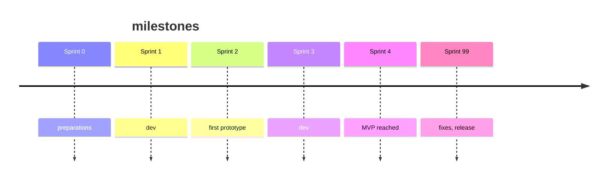
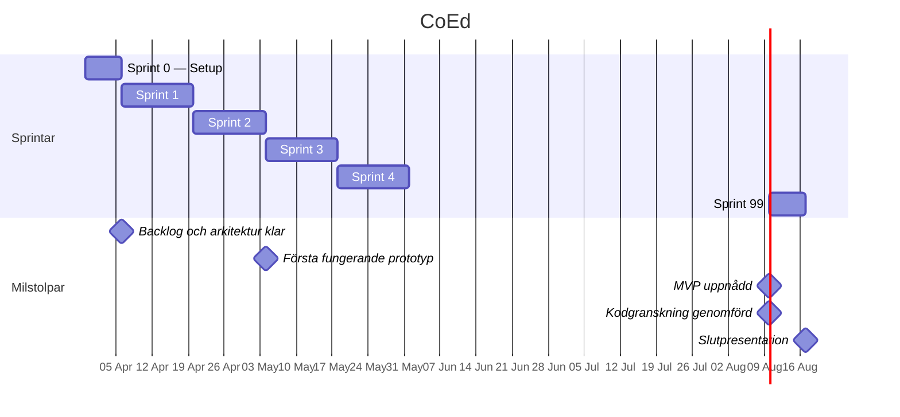

**Innehållet här är inte kopplat till krav eller något ni måste göra i kursen.**

Se innehållet som tips eller hjälp som eventuellt skulle kunna vara användbart för er.

Milstolpar och Gantt-schema är begrepp från traditionell projektplanering som dyker upp ofta. Här ges en kortfattad ingång till vad det är och som exempel hur de skulle kunna användas i förhållande till kursens sprintar.

## Vad är en milstolpe?

En **milstolpe** (*milestone*) är en händelse eller ett mål i ett projekt — inte ett arbetsmoment utan ett *resultat* som markerar att något viktigt är uppnått. Milstolpar har alltså inget varaktighet, ingen timebox; de är punkter i tid.

Exempel kopplat till kursen:

- "Scenario i MVP är uppnådd"
- "Alla krav är implementerade med hög prio"
- "Code Review av sprint 2genomförd"
- "Inlämning och release genomförd"

I traditionella projekt används milstolpar för att dela upp ett långt arbete i några slags 'kontrollpunkter' — både för teamet självt och för externa intressenter (stakeholders) som vill veta eller informeras om när något levereras.

## Vad är ett Gantt-schema?

Ett **Gantt-schema** är ett diagram som visualiserar ett projekts aktiviteter längs en tidslinje. Varje aktivitet visas som ett horisontellt fält; milstolpar markeras ofta som diamanter eller lodräta linjer.

Gantt passar i projekt där:

- Aktiviteterna är kända i förväg
- Det finns tydliga beroenden mellan uppgifter
- Tidsplanen är fastlagd

Det passar **sämre** för iterativt, agilt arbete — där backloggen förändras, prioriteringar justeras och teamet lär sig längs vägen. Att låsa ett Gantt-schema i vecka ett och sedan följa det slaviskt motverkar just den adaptivitet som Scrum syftar till.

:::tip
Milstolpar kan användas för att markera viktiga leveranser/releaser. Ett helt projekt ska inte planeras i ett Gantt-schema - däremot kan det vara en poäng att initialt till exempel placera när vad bör vara klart utifrån beroenden.
:::

## Vad motsvarar milstolpar i kursen?

Kursen har inga formella milstolpar, men på sätt och viss kan varje sprint ses som en. Som grupp skulle man kunna tänka sig att sätta ett antal milstolpar utefter sprintarna.  

Ett exempel:

| Milstolpe | När |
|---|---|
| Förberedelser och val klart | Slutet av Sprint 0 |
| Första fungerande prototyp | Sprint 2 |
| MVP uppnådd | Sprint 3 |
| Relase CoEd | Sprint 4 |
| Slutpresentation och demo | Sprint 99 |

Dessa punkter är inte inlämningar i sig, men skulle kunna vara bra att ha som interna 'kontrollpunkter' för gruppen.

Ytterligare ett exempel:

GitHub Projects har inbyggt stöd för milstolpar (*Milestones*) — direkt i repot.
Exempelvis kan issues och pull requests kopplas till en milstolpe.

Hur man gör lämnas till den nyfikna.

---

## Gantt-schema

Gantt-schemat ger en annan vy över samma information — här syns aktiviteterna som fält längs en tidslinje.  
Scheman kan göras i princip i vilket verktyg som helst - till exempel Google Sheets eller Excel.

Gantt:

---

## Sammanfattning

- Milstolpar markerar viktiga punkter i projektet, inte arbetsmoment.
- Gantt-schema passar bättre för sekventiell planering än för iterativt arbete — använd det som orienteringskarta, inte som styrande plan.
- Kursens naturliga milstolpar är Sprint 0-avslut, första prototyp, MVP, kodgranskning och slutpresentation (Sprint 99).
- GitHub Projects har inbyggt stöd för milstolpar och kopplar dem direkt till issues och pull requests.